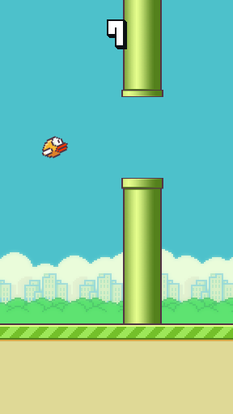

# flappy-bird-assets

A faithful, dependency-free recreation of **Flappy Bird**, built on the classic asset pack
(sprites + sounds, MIT licensed).



## Play

Serve the folder over HTTP (canvas + audio need a real server, not `file://`):

```bash
python3 -m http.server 8000
# then open http://localhost:8000
```

| Input | Action |
| --- | --- |
| `SPACE` / `↑` / `W` / click / tap | flap |
| `M` | mute / unmute |

## What's implemented

- Ready → playing → dying → game-over state machine with the original's feel
  (gravity 0.25, jump −4.6, 100 px pipe gap, 2 px/frame scroll on a 288×512 field).
- Flapping wing animation, rotation with a nose-dive on the fall, forgiving hitbox.
- Scrolling ground, proportional outlined score digits, day/night every 20 points.
- Death flash + screen shake-free flash, tumbling fall, "Game Over" banner drop-in,
  sliding scoreboard with SCORE / BEST, bronze–platinum medals (10/20/30/40) and a NEW badge.
- Best score persisted in `localStorage`; sounds (ogg with wav fallback) pooled for overlaps.
- Touch + mouse + keyboard input, tab-hidden pause, crisp pixel scaling to any window size.

## Structure

- `js/core.js` — pure simulation, no DOM (also used by the headless test harness).
- `js/render.js` — canvas renderer (browser or headless `@napi-rs/canvas`).
- `game.js` — browser bootstrap: assets, input, audio, fixed-timestep rAF loop.
- `sprites/`, `audio/` — the original asset pack.
